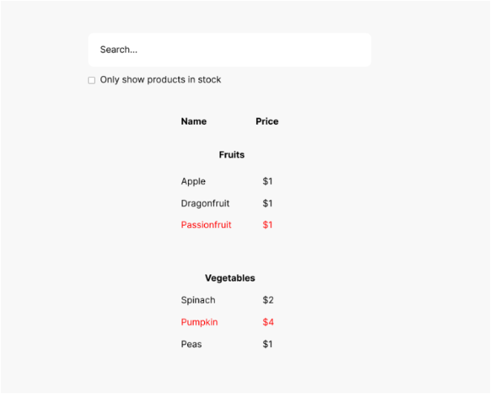
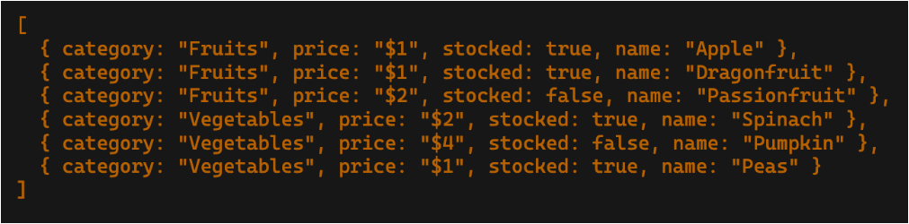
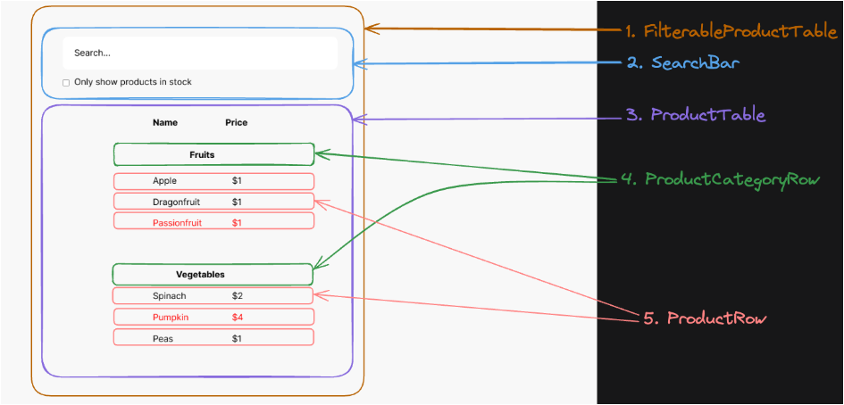

## Thinking in React (Coder's Gyan)
[Timeline : 37 min]

How to planing of proper page architecture -
1] UI mockup

2] JSON API



<br>

### Step 1: Break the UI into a components
- Visually break into components



### Step 2: Build static version in React
1. Build static components
2. Don't worry about state yet!
3. Use either :-
	- `top down` approach : Big component -> to -> Small component building
	- Mostly used "top down"
	- `bottom up` approach : Small component -> to -> Big component building
	- For complex & larger project "bottom up" is easy

- [x] Check Hierarchy of Components:
```
- FilterableProductTable
	- SearchBar
	- ProductTable
		- ProductCategoryRow
		- ProductRow
```


#### Installation setup using vite framework

- [x] React
- Step 1.
```sh
npm create vite@latest
```
- Step 2.
```sh
cd thinking-react
npm install
```
- Step 3.
```sh
npm run dev
```

- [x] Tailwind CSS
- Step 1.
```sh
npm install tailwindcss @tailwindcss/vite
```
- Step 2. 
- Update in -> `vite.config.js`
```js
  import { defineConfig } from 'vite'
  import react from '@vitejs/plugin-react'
  import tailwindcss from '@tailwindcss/vite'

  // https://vite.dev/config/
  export default defineConfig({
    plugins: [react(), tailwindcss()],
  })
```
- Step 3. 
- Update in -> `index.css`
```css
@import "tailwindcss";
```
- Step 4.
```sh
npm run dev
```

#### After simple setup 

`App.jsx`
```jsx
import './App.css';

function App() {

  return (
    <>
      <h1>Thinking in React</h1>
    <>
  );
}

export default App;
```

<br>

----------

<br>


#### Building Components using "top down" approach

- Create folder "components" in -> `src/components/`
	- Create file top down way `src/components/FilterableProductTable.jsx`
	
- Add boiler plate code in --> `FilterableProductTable.jsx` => `rafce`
	```jsx
		const FilterableProductTable = () => {
		return (
			<div>FilterableProductTable</div>
		)
	}

	export default FilterableProductTable
	```

- Add boiler plate code in --> `SearchBar.jsx` => `rafce`
	```jsx
	const SearchBar = () => {
		return (
			<div>SearchBar</div>
		)
	}

	export default SearchBar
	```

- [x] create other components with boiler plate code => `rafce`
- components Hierarchy :-
```
- FilterableProductTable
	- SearchBar
	- ProductTable
		- ProductCategoryRow
		- ProductRow
```

#### Build Static version & Render components in "top down" way -

1.] - FilterableProductTable 
[1]. - SearchBar component render into --> 
`FilterableProductTable.jsx`.
- export 👍 SearchBar from `SearchBar.jsx` & import into `FilterableProductTable.jsx`

[2]. - Also render ProductTable component into --> 
`FilterableProductTable.jsx`.
- export 👍 ProductTable from `ProductTable.jsx` & import into `FilterableProductTable.jsx`

[3]. - Update in --> `FilterableProductTable.jsx`
```jsx
import SearchBar from './SearchBar';
import ProductTable from './ProductTable';

const FilterableProductTable = () => {
	return (
		<>

			<SearchBar />
			<ProductTable />

		</>
	);
}

export default FilterableProductTable;
```

[4.] Add Search & Checkbox in --> `SearchBar.jsx`

```jsx
const SearchBar = () => {
	return 
		<form>
			<input type="text" placeholder="Search..."/>
		</form>;
	
};

export default SearchBar;
```

[5.] Render the main component & import & Update in --> `App.jsx`
- Remove default import style --> ./App.css

```jsx
import FilterableProductTable from './components/FilterableProductTable';

function App() {

  return (
    <>
      <FilterableProductTable />
    </>
  );
}

export default App;
```

- [x] Remove default css from --> `main.jsx`

<br>

2.] SearchBar 
- Add checkbox & update in --> `SearchBar.jsx` 

<br>

3.] ProductTable
- Add Name & Price & update in --> `ProductTable.jsx`

<br>

4.] ProductCategoryRow
- Render & import `ProductCategoryRow` into in --> `ProductTable.jsx`

<br>

5.] ProductRow
- Add table that & Render in --> `ProductRow.jsx`

`SearchBar.jsx`
```jsx
const SearchBar = () => {
	return (
		<form>
			<input type="text" placeholder="Search..."/>
			<div>
				<input id="checkbox" type="checkbox" />
				<label htmlFor="checkbox">Show only inStock</label>
			</div>
		</form>
	);
	
};

export default SearchBar;
```

`ProductTable.jsx`
```jsx
import ProductCategoryRow from './ProductCategoryRow';

import ProductRow from './ProductRow';
const ProductTable = () => {
	return (
		<table>
			<thead>
				<tr>
					<th>Name</th>
					<th>Price</th>
				</tr>
			</thead>
			<tbody>
				<ProductCategoryRow />
				<ProductRow/>
			</tbody>
		</table>
	)
}

export default ProductTable;
```

`ProductCategoryRow.jsx`
```jsx
const ProductCategoryRow = () => {
	return (
		<tr>
			<th colSpan="2">Fruits</th>
		</tr>
	)
}

export default ProductCategoryRow
```

`ProductRow.jsx`
```jsx
const ProductRow = () => {
	return (
		<>
		<tr>
			<td>Apple</td>
			<td>$1</td>
		</tr>
		<tr>
			<td>DragonFruit</td>
			<td>$1</td>
		</tr>
		<tr>
			<td>PassionFruit</td>
			<td>$1</td>
		</tr>
		</>
	)
}

export default ProductRow
```


<br>

--- Static version of site completed ----

<br>


### Step 3: Find the minimal but complete representation of UI state
- We will add interactivity i.e. search interactivity
- we need a `STATE`

- [x] All the pieces of data:
1. The original list of products
2. The search text the user has entered
3. The value of the checkbox
4. The filtered list of prodcuts

- [x] Which are not state?
- `Does it remain unchanged over time?` If so, it isn't state.
- `Is it passed in from a parent via props?` If so, it isn't state.
- `Can you compute it based on existing state or props in your component?` If so, it definitely isn't state.

- [x] What's left is `probably state`.
- `search text`, `checkbox ` is changed overtime.
- In that application that are states only.


<br>


### Step 4: Identify where your state should live

- [x] `This step is challenging`

- You can figure it out by following these steps!
	- Identify every component that renders something based on that state.
	- Find their closest common parent component - a component above them all in the hierarchy.

Decide where the state should live:
- Often, you can put the state directly into their common parent.
- You can also put the state into some components above their common parent.
- If you can't find a component where it makes sense to own the state.
- Create a new component solely for holding the state and add it somewhere in the hierarchy above the common parent component.

<br>

#### Create states
- Create state in `FilterableProductTable.jsx`
- Pass `searchText` & `inStockOnly` i.e. checkbox state is used in both component.
	- That props are pass into parent to child component.
- Receive `searchText` in `SearchBar.jsx`

> - [!NOTE]
> - Searching capabilities not working in 2 way binding 
> - It give ERROR on console log - "You provided a `value` prop to a form field without an `onChange` handler." 
> - That means states are present in both components for render.

<br>

### Step 5: Add inverse dataflow
- Pass state setters down to the components.

#### How to update from child component data to use state of parent component?
- That for we used `callbacks` or `functions`.
- Pass `setSearchText` & `				setInStockOnly` in --> `FilterableProductTable.jsx`
- Recieve `setInStockOnly` & `setSearchText` in --> `SearchBar.jsx`
- Add also, onChange in that `setInStockOnly` & `setSearchText`

- [x] Inject "products" from `App.jsx` (PRODUCTS from db) to --> `ProductTable.jsx`

